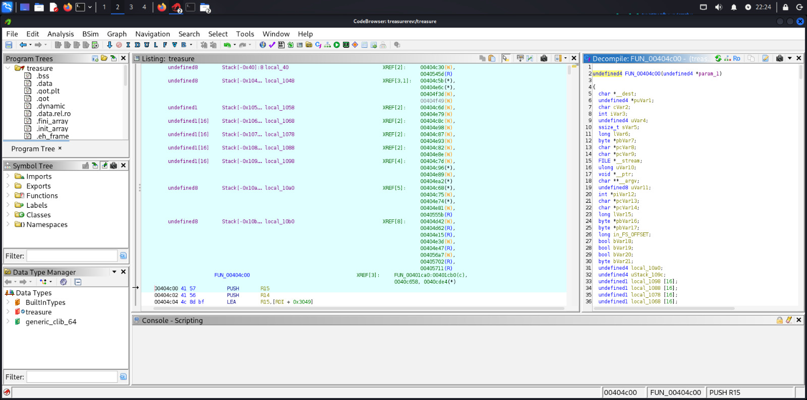

# Write-up: Reverse Engineering crackme 2

# Summary

Tujuan dari tantangan ini adalah untuk mengidentifikasi algoritma validasi input pengguna dan membuat sebuah keygen sederhana. Program menerima username dan password sebagai input, kemudian melakukan kalkulasi aritmatika untuk memverifikasi kecocokan keduanya.
Metadata

Nama: Treasure
Tipe: C++ Console Application
Arsitektur: x86-64
Tools: Ghidra
Difficulty: 2.2 (Medium)

# PROSES DALAM GHIDRA

# Hasil eksekusi menggunakan terminal

