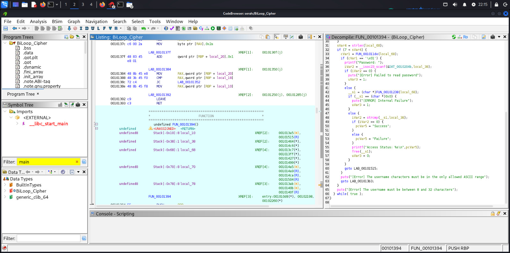
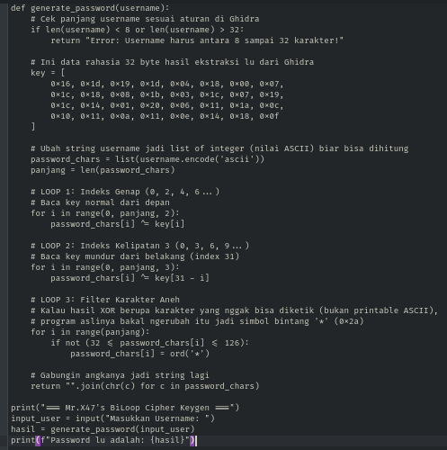
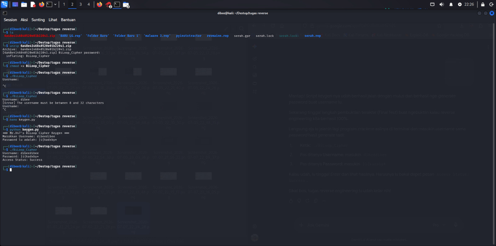

# Write-up Analisis: CrackMe-02 (Medium)

# Metadata

Nama: BiLoop_Cipher
Target: mbb.exe
Tipe: C++ Console Application
Arsitektur: x86-64
Tools: Ghidra
Difficulty: 2.0 (Medium)

# Proses dalam Ghidra

# Penjelasan
- Baris 42: __s1 = (char *)FUN_00101238(local_68);
  Nah, ini dia jantung utamanya! Fungsi FUN_00101238 ini menerima username lu (local_68), lalu memprosesnya untuk menghasilkan password yang benar. Hasil password aslinya itu disimpen di variabel __s1.

- Baris 48: iVar2 = strcmp(__s1, local_38);
  Fungsi strcmp (String Compare) ini tugasnya ngebandingin __s1 (password asli yang di-generate program) dengan local_38 (password yang lu ketik di terminal tadi).

- Baris 49-55: Kalau hasilnya cocok (sama dengan 0), dia bakal nge-set status jadi "Success". Kalau nggak cocok, statusnya "Failure".

- Baris 62-63: Kalau lu perhatiin di bawah, ada pesan [Error] The username characters must be in the only allowed ASCII range. Ini nyambung sama fungsi FUN_001011de di screenshot lu sebelumnya.
- Artinya, username lu hurufnya nggak boleh sembarangan (biasanya dibatasi cuma boleh huruf abjad atau angka aja).

- # Membuat script keygen.py
- 

# Result

